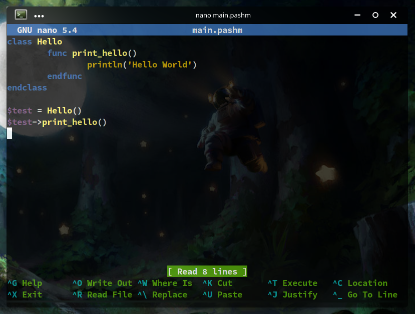

# pashmak nanorc
Pashmak programming language syntax highlighting file for GNU nano editor.

<a href="https://github.com/sami2020pro/pashmak-nanorc/tree/main/data/preview.png">
	
</a>

## installation
Follow the guide below

```bash
$ sudo ./install
```

And next put the following line on the `/etc/nanorc` or `~/.nanorc` (Wherever you like)

```bash
include "/usr/share/nano/extra/pashmak.nanorc"
```
